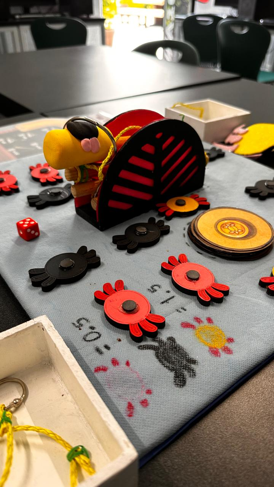
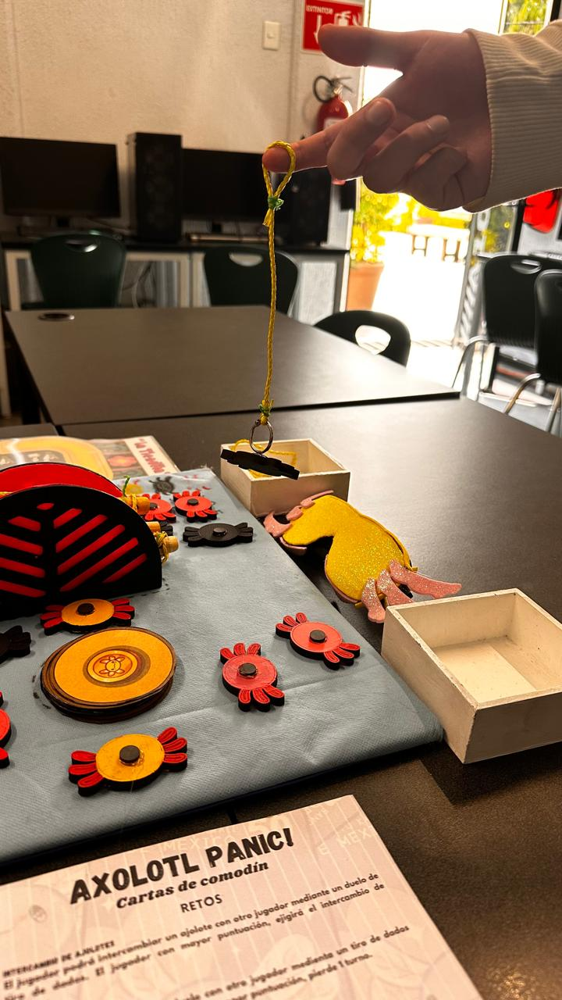
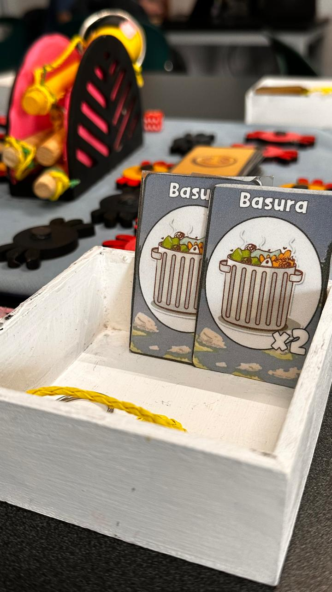

# Axolotl-Panic!: Deluxe
 - Patricio Fuentes Silva 
 - Celeste Bautista Altamirano
 - Rogelio Angel Hugo Sanchez Camacho

### Axolotl Panic!(Versión Fisica)
__Nombre__: Axolotl Panic"

__Introducción__: En la actualidad, los ajolotes estan en peligro de extinción masivo, ya que en el habitat en donde viven no es un lugar seguro, asi que los jugadores tomaran roles de biologos y tendrán que poner en cautiverio a los ajolotes para que puedan reproducirse y que su esperanza de vida aumente.

__Objetivo del Juego__: Obtener el mayor puntaje de ajolotes obtenidos, basandose en el valor de ellos, para ello tendrían que recolectar basura para así salvar a los ajolotes.

__Instructivo__: - [Ver aquí](https://www.canva.com/design/DAGTvw1e8eM/dRhkooZ1-lSwgkIIoVXI6w/edit?utm_content=DAGTvw1e8eM&utm_campaign=designshare&utm_medium=link2&utm_source=sharebutton)

__Mecánicas__: 

- Recolectar basura
- Rescatar Ajolotes

__Elementos__:
- Ficha de Ajolotes Rosas -  8
- Ficha de Ajolotes Grises- 6
- Ficha de Ajolotes Amarilos - 4
- Ajolocartas - 44
- Ansuelos - 4
- Cañas de Pescar - 3
- Cañas de Pescar Profesional - 1
- Cartas de Comodínes - 17
- Cartas de Comida +0.5 -  6
- Cartas de Comida + 1 - 4
- Cartas de Comida +1.5 - 3
- “La Tiendita” - 1
- Tablero - 1
- Lentes de Ajolotes - 1

##### Retos de Físico a Digital
-
-
-

